<p align="center">
  
</p>

<p align="center">
  
  
  
  
</p>

<p align="center">
  <a href="../../releases/latest"></a>
</p>

<p align="center">
  Un teleprompter de escritorio que flota encima de tus aplicaciones y <b>no aparece al compartir pantalla</b>, en grabaciones ni en capturas.<br>
  Lee tu guion en videollamadas, presentaciones y grabaciones sin que nadie más lo vea.
</p>

<br>

## Invisible al compartir pantalla

<p align="center">
  
</p>

Ni la ventana, ni sus menús, tooltips, ajustes o diálogos de archivo aparecen en **Teams, Zoom, Google Meet, OBS**, la herramienta Recortes o cualquier captura. El candado de la barra indica el estado en todo momento: verde, invisible; rojo, visible.

## Funciones

<p align="center">
  
</p>

<details>
<summary><b>Ver la lista completa</b></summary>
<br>

- **Siempre encima** de las demás aplicaciones, con fondo semitransparente ajustable.
- **Pantalla completa o modo ventana** con un botón, <kbd>F11</kbd> o doble clic.
- **Desplazamiento automático** suave, con velocidad en líneas por minuto, cuenta regresiva y tiempo restante estimado.
- **Desplazamiento manual** con la rueda del ratón, el teclado o la barra de posición, incluso mientras avanza solo.
- **Editor integrado** para escribir, pegar o corregir el guion.
- **Parámetros ajustables**: fuente, tamaño, grosor, interlineado, alineación, márgenes, colores, opacidad, franja de lectura y modo espejo.
- **Atajos globales** que funcionan aunque la videollamada tenga el foco.
- Modo que **deja pasar los clics** a la ventana de abajo.
- Recuerda la posición de la ventana, los ajustes y el último guion.

</details>

## Abre tus documentos

<p align="center">
  
</p>

| Formato | Qué se conserva |
|---|---|
| **PDF** | Párrafos reconstruidos y títulos detectados por tamaño de letra, sin encabezados, pies ni números de página repetidos. Las páginas escaneadas pasan por OCR. |
| **Word** (.docx) | Títulos, negritas, cursivas, listas con viñetas y numeradas, saltos de línea y tablas. |
| **Markdown** (.md) | Todo el formato anterior. |
| **Texto** (.txt) | El texto tal cual, con detección automática de codificación. |

Arrastra el archivo a la ventana o ábrelo con <kbd>Ctrl</kbd> + <kbd>O</kbd>. Los `.doc` antiguos no son compatibles: guárdalos como `.docx` desde Word. El OCR usa los idiomas instalados en Windows; si un PDF escaneado no se lee, agrega el idioma en **Configuración > Hora e idioma > Idioma y región** con la opción de reconocimiento óptico de caracteres.

## Instalación

Funciona en Windows 10 versión 2004 o posterior y en Windows 11, de 64 bits. No necesita instalar .NET ni permisos de administrador.

### Opción 1: versión compilada (recomendada)

1. Descarga `Teleprompter-<versión>-win-x64.zip` desde [Releases](../../releases/latest).
2. Descomprímelo y haz doble clic en `instalar.cmd`.
3. Busca **Teleprompter** en el menú Inicio o usa el acceso directo del escritorio.

Si prefieres no instalar nada, abre directamente `app\Teleprompter.exe` dentro de la carpeta descomprimida.

> [!NOTE]
> La aplicación no está firmada digitalmente, así que Windows puede mostrar un aviso de SmartScreen la primera vez. Para continuar elige **Más información** y luego **Ejecutar de todas formas**.

### Opción 2: compilar desde el código

1. Instala el [SDK de .NET 10](https://dotnet.microsoft.com/download).
2. Abre la carpeta `installer` y haz doble clic en `instalar.cmd`.

En ambos casos el instalador copia la aplicación a `%LOCALAPPDATA%\Programs\Teleprompter`, crea los accesos directos en el menú Inicio y en el escritorio y la registra en **Configuración > Aplicaciones**. Para actualizar, ejecuta el instalador de la versión nueva: conserva tus ajustes y el último guion.

<details>
<summary><b>Opciones del instalador</b></summary>
<br>

```powershell
.\instalar.ps1 -SinEscritorio   # sin acceso directo en el escritorio
.\instalar.ps1 -NoAbrir         # no abrir la aplicación al terminar
```

</details>

## Uso

1. Abre un documento, arrástralo a la ventana o pulsa **Escribir o pegar**.
2. Coloca la ventana cerca de la cámara y ajusta su tamaño desde los bordes, o usa el botón de pantalla completa junto al candado.
3. Pulsa <kbd>Espacio</kbd> para iniciar. La barra de herramientas se oculta sola mientras el texto avanza y reaparece al pasar el ratón.

## Atajos de teclado

**Con la ventana activa**

| Tecla | Acción |
|---|---|
| <kbd>Espacio</kbd> | Iniciar o pausar |
| <kbd>↑</kbd> <kbd>↓</kbd> | Mover una línea |
| <kbd>RePág</kbd> <kbd>AvPág</kbd> | Mover casi una pantalla |
| <kbd>←</kbd> <kbd>→</kbd> | Bajar o subir la velocidad |
| <kbd>Ctrl</kbd> + <kbd>←</kbd> <kbd>→</kbd> o <kbd>Ctrl</kbd> + rueda | Tamaño de letra |
| <kbd>Inicio</kbd> <kbd>Fin</kbd> | Ir al principio o al final |
| <kbd>F11</kbd> o doble clic | Pantalla completa o modo ventana |
| <kbd>Ctrl</kbd> + <kbd>O</kbd> | Abrir documento |
| <kbd>Ctrl</kbd> + <kbd>E</kbd> | Editar el guion |
| <kbd>Ctrl</kbd> + <kbd>S</kbd> | Guardar el guion como `.md` o `.txt` |
| <kbd>Ctrl</kbd> + <kbd>,</kbd> | Ajustes |
| <kbd>Esc</kbd> | Pausar, terminar la edición o salir de pantalla completa |

**Globales, desde cualquier aplicación**

| Atajo | Acción |
|---|---|
| <kbd>Ctrl</kbd> + <kbd>Alt</kbd> + <kbd>Espacio</kbd> | Iniciar o pausar |
| <kbd>Ctrl</kbd> + <kbd>Alt</kbd> + <kbd>↑</kbd> <kbd>↓</kbd> | Subir o bajar la velocidad |
| <kbd>Ctrl</kbd> + <kbd>Alt</kbd> + <kbd>RePág</kbd> <kbd>AvPág</kbd> | Retroceder o adelantar el texto |
| <kbd>Ctrl</kbd> + <kbd>Alt</kbd> + <kbd>Inicio</kbd> | Volver al inicio |
| <kbd>Ctrl</kbd> + <kbd>Alt</kbd> + <kbd>H</kbd> | Mostrar u ocultar el teleprompter |
| <kbd>Ctrl</kbd> + <kbd>Alt</kbd> + <kbd>T</kbd> | Dejar pasar los clics o volver a usar el ratón |

Si otra aplicación ya usa alguno de estos atajos, la ventana de ajustes lo indica.

<details>
<summary><b>Formato del guion en el editor</b></summary>
<br>

El editor usa Markdown sencillo:

| Escribes | Obtienes |
|---|---|
| Línea en blanco | Párrafo nuevo (un salto de línea simple se respeta tal cual) |
| `# Título` y `## Subtítulo` | Títulos más grandes |
| `**negrita**` y `*cursiva*` | Énfasis |
| `- elemento` y `1. elemento` | Listas con viñetas y numeradas |
| `> texto` | Cita resaltada |
| `---` | Línea separadora |

</details>

## Limitaciones

- La invisibilidad aplica a capturas por software. Una cámara o un teléfono apuntando a la pantalla sí la ven.
- Si compartes la pantalla completa, el ícono de la barra de tareas sí se ve. Puedes ocultarlo en **Ajustes > Ventana > Mostrar en la barra de tareas** y usar <kbd>Ctrl</kbd> + <kbd>Alt</kbd> + <kbd>H</kbd> para mostrar u ocultar la ventana.
- En Windows anteriores a la versión 2004 la ventana se ve como un recuadro negro en lugar de desaparecer.

## Datos y desinstalación

Los ajustes y el último guion se guardan en `%LOCALAPPDATA%\Teleprompter`. Si ocurre un error inesperado, los detalles quedan en `errores.log` en esa misma carpeta.

Para desinstalar, busca Teleprompter en **Configuración > Aplicaciones > Aplicaciones instaladas** y elige **Desinstalar**. Al final pregunta si quieres borrar también tus ajustes.

## Desarrollo

<details>
<summary><b>Compilar, empaquetar y estructura del proyecto</b></summary>
<br>

Ejecutar sin instalar:

```powershell
dotnet run --project src/Teleprompter
```

Generar el paquete para Releases:

```powershell
.\installer\empaquetar.ps1
```

Deja en `artifacts` el `.zip` con la aplicación compilada, el instalador, este README y la licencia, junto con su huella SHA256. La versión se toma de `<Version>` en `src/Teleprompter/Teleprompter.csproj`.

```
src/Teleprompter/
  Import/       Lectura de PDF (con OCR), DOCX, Markdown y texto
  Rendering/    Conversión del guion a texto en pantalla
  Services/     Invisibilidad en capturas, atajos globales, almacenamiento
  Controls/     Selector de color y convertidores
installer/      Instalador, desinstalador y script de empaquetado
docs/readme/    Ilustraciones animadas de este README
```

</details>

## Licencia

Distribuido bajo la licencia MIT. Consulta el archivo [LICENSE](LICENSE).
